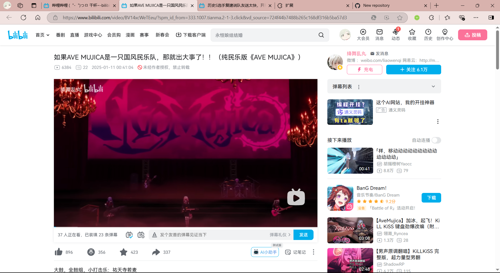
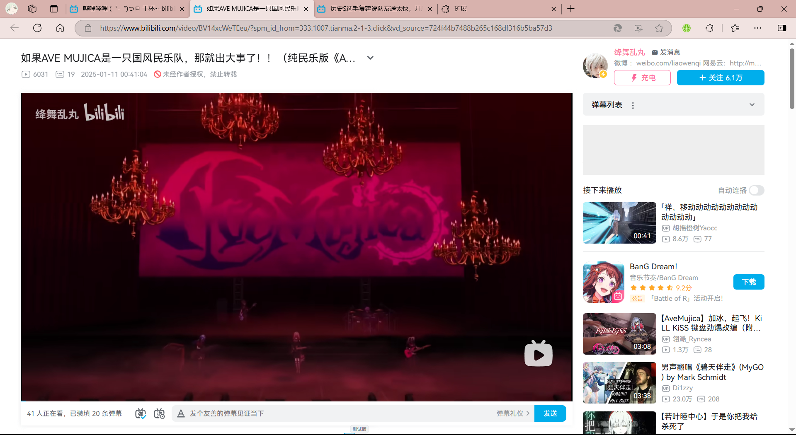
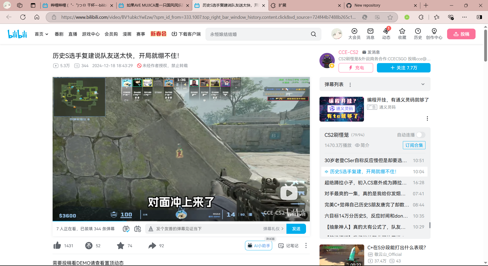

# BiliLite

作用于B站的浏览器插件，主要功能有：

- 简化UI
- 默认宽屏播放
- 拦截广告
- ...

效果如图：

| before                                                      | after                                                        |
| ----------------------------------------------------------- | ------------------------------------------------------------ |
|  |          |
|  |          |
|  |  |

